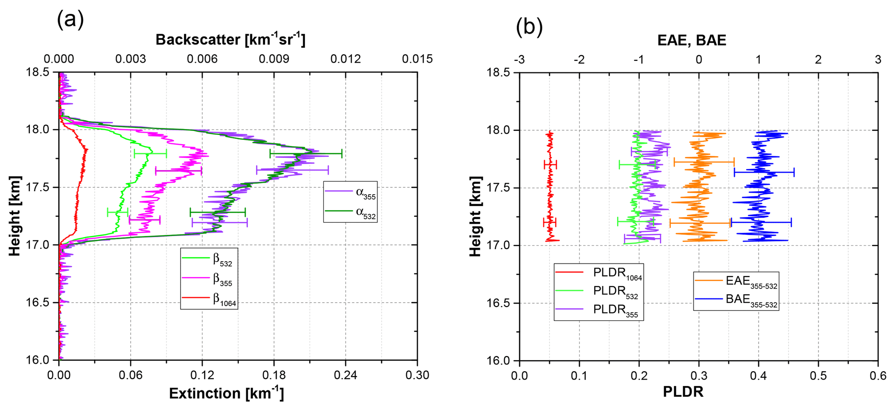

# 平流层烟尘

随着全球气候变暖，干燥的天气出现越发频繁，这些条件使得大范围的森林大火出现的概率越来越大。仅2019年，全球范围内就出现了多起创纪录的森林大火，如：10月份的美国加利福利亚森林大火、8月份的亚马逊森林大火和持续数月的澳大利亚森林大火。这些森林大火在直接摧毁当地生态系统，对人类生命财产造成威胁的同时，也会向大气中排放大量的烟尘（多达数千吨）。这些烟尘颗粒受到大范围对流和辐射加热的影响下，会突破对流层顶到达垂直结构稳定的平流层中，并且随着全球环流，跨越大洲进行传输，进而影响全球大气环境和辐射收支平衡。

## 平流层烟尘的影响

**影响全球范围内的辐射收支平衡（降温）**

平流层烟尘颗粒具有强吸收性，能极大的吸收太阳辐射，使到达地表的辐射通量减小；且因为平流层中的温度梯度结构，平流层中的颗粒物难以进行沉降，生命周期能达到数年，因此可以顺着大气环流进行环绕半球的运动，从而对半球范围内的辐射收支产生影响，如：导致半球范围内的降温。

 
<b>澳大利亚森林大火烟尘传输～1万公里到达南美洲上空[1]</b>

**威胁航运**

极端的平流层烟尘可以强烈影响平流层内的能见度，对航运安全造成影响。

 
<b>澳大利亚森林大火产生的火积云（Pyrocumulus）[2]</b>

## 平流层烟尘的来源

平流层的烟尘来源是地表生物质气溶胶的燃烧，着火点会强烈加热大气，从而促进大尺度强对流的产生。强对流气团在数小时内会将燃烧产生的烟尘和地面其他颗粒物质携带到高空及低平流层[3]，而烟尘中的黑碳在达到高空后会强烈吸收太阳辐射，并对气团周围大气进一步加热，使气团的密度减少，从而能达到更高的高空（观测结果显示能达到～25km[4,5]）。

## 平流层烟尘的微物理特性和激光雷达的观测结果

经过实地采样分析发现，平流层中的烟尘颗粒的形状和占比如下图所示

 
<b>烟尘例子的电镜照片：（左）分形碳聚合物（占采样总数的95%）；（右）无定形碳（占采样总数的5%）[6]</b>

由此可以推断，平流层烟尘的主要成分为含碳物质，且粒径范围在亚微米级，而且大多数颗粒的形态为非球型的分形碳聚合物。粒径的采样结果被AERONET中对加拿大森林大火烟尘的观测结果所证实，如下图所示[7]：

 
<b>传输到德国上空的加拿大森林大火烟尘的粒径分布</b>

基于观测得到的2017年08月德国上空的加拿大森林大火产生的烟尘的微物理特性如下[7]：

 
<b>基于多波长激光雷达反演得到的平流层和对流层中的烟尘的微物理微物理性质</b>

然而平流层烟尘的微物理性质并非一直不变，在长距离传输中，平流层中的硫酸盐会不断地聚集到多孔的分型聚合物的表面，从而使烟尘颗粒的外在形状逐渐球形化（称为烟尘颗粒物的老化）。平流层的烟尘在远距离传输后，逐渐弥散到整个平流层中。其中也有很大一部分也会通过东亚季风重新注入到对流层中，但是这个当量现在还并不清楚[8]。

## 平流层烟尘的激光雷达的观测结果

### 2017年08月加拿大森林大火产生的平流层烟尘

 
<b>在捷克Kosetice多波长激光雷达观测的加拿大烟尘例子[4]</b>

在捷克的Kosetice的多波长激光雷达Polly-XT连续多天观测到了平流层烟尘，并通过后向轨迹追踪和卫星观测结果，将该烟尘源追溯到2017年08月的加拿大森林大火，并经过数十天的传输到达欧洲大陆。

该烟尘羽的光学厚度（AOT）最大达到1（532 nm），等效到平流层中的能见度仅为数公里。且532 nm的体退偏比（粒子非球型度的度量，该值越大代表粒子的非球型度越高）超过0.15，表示该烟尘羽主要由非球型粒子组成。

 
<b>在法国里尔（Lille）的三波长偏振激光雷达观测结果[9]</b>

在法国里尔的激光雷达雷达同样捕捉到了该烟尘羽的细节，且得到了高质量烟尘羽光学性质剖面。反演结果如下：

 
<b>加拿大森林大火烟尘的雷达观测统计结果[9]</b>

### 2019－2020年澳大利亚森林大火产生的平流层烟尘

 
<b>在智利Punta-Arenas的多波长激光雷达的观测结果[10]</b>

如上是在智利观测到的澳大利亚森林大火的例子，该结果显示传输到1万公里外的Punta-Arenas时，该烟尘羽的高度甚至到达了惊人的26公里（对流层顶高度在约13km），这样高的高度说明辐射加热对烟尘羽本身的抬升存在强烈的影响。

### 南北半球平流层烟尘光学性质对比

 
<b>南北半球平流层烟尘的光学性质对比[10]</b>

在这两个例子中，南半球的烟尘的吸收特性似乎比北半球的更强（参考如上左图），而非球型度则相对更低（参考如上右图）。但整体而言南北半球烟尘的光学特性很接近，这也为星载平台进行平流层烟尘鉴别和光学性质反演提供了支持[7,10]。

## 拓展阅读

- http://pyrocb.ssec.wisc.edu/
- https://dacapo.tropos.de/index.php/blog/48-say-farewell-to-pristine-marine-atmospheric-conditions-over-punta-arenas

## 相关参考

1. https://weather.com/news/news/2020-01-06-australia-wildfire-smoke-detected-in-south-america
2. https://wildfiretoday.com/2020/01/04/stunning-photos-of-pyrocumulus-over-fires-in-australia/?hilite=%27wyoming%27
3. Fromm, M., D. T. Lindsey, R. Servranckx, G. Yue, T. Trickl, R. Sica, P. Doucet, and S. Godin-Beekmann (2010), The untold story of pyrocumulonimbus, Bulletin of the American Meteorological Society, 91(9), 1193-1210, doi:https://doi.org/10.1175/2010bams3004.1.
4. Ansmann, A., H. Baars, A. Chudnovsky, I. Mattis, I. Veselovskii, M. Haarig, P. Seifert, R. Engelmann, and U. Wandinger (2018), Extreme levels of Canadian wildfire smoke in the stratosphere over central Europe on 21–22 August 2017, Atmospheric Chemistry and Physics, 18(16), 11831-11845, doi:https://doi.org/10.5194/acp-18-11831-2018.
5. De Laat, A., D. C. Stein Zweers, R. Boers, and O. N. Tuinder (2012), A solar escalator: Observational evidence of the self‐lifting of smoke and aerosols by absorption of solar radiation in the February 2009 Australian Black Saturday plume, Journal of Geophysical Research: Atmospheres, 117(D4), doi:https://doi.org/10.1029/2011JD017016.
6. Strawa, A., K. Drdla, G. Ferry, S. Verma, R. Pueschel, M. Yasuda, R. Salawitch, R. Gao, S. Howard, and P. Bui (1999), Carbonaceous aerosol (soot) measured in the lower stratosphere during POLARIS and its role in stratospheric photochemistry, Journal of Geophysical Research: Atmospheres, 104(D21), 26753-26766, doi:https://doi.org/10.1029/1999JD900453.
7. Haarig, M., A. Ansmann, H. Baars, C. Jimenez, I. Veselovskii, R. Engelmann, and D. Althausen (2018), Depolarization and lidar ratios at 355, 532, and 1064 nm and microphysical properties of aged tropospheric and stratospheric Canadian wildfire smoke, Atmospheric Chemistry and Physics, 18(16), 11847-11861, doi:https://doi.org/10.5194/acp-18-11847-2018.
8. Kloss, C., G. Berthet, P. Sellitto, F. Ploeger, S. Bucci, S. Khaykin, F. Jégou, G. Taha, L. W. Thomason, and B. Barret (2019), Transport of the 2017 Canadian wildfire plume to the tropics via the Asian monsoon circulation, doi:https://doi.org/10.5194/acp-19-13547-2019.
9. Hu, Q., P. Goloub, I. Veselovskii, J.-A. Bravo-Aranda, I. E. Popovici, T. Podvin, M. Haeffelin, A. Lopatin, O. Dubovik, and C. Pietras (2019), Long-range-transported Canadian smoke plumes in the lower stratosphere over northern France, Atmospheric Chemistry and Physics, 19(2), 1173-1193, doi:https://doi.org/10.5194/acp-19-1173-2019.
10. Ohneiser, K., Ansmann, A., Baars, H., Seifert, P., Barja, B., Jimenez, C., Radenz, M., Teisseire, A., Floutsi, A., Haarig, M., Engelmann, R., Zamorano, F., Bühl, J., and Wandinger, U.: Smoke of extreme Australian bushfires observed in the stratosphere over Punta Arenas, Chile, in January 2020: optical thickness, lidar ratios, and depolarization ratios at 355 and 532 nm, Atmos. Chem. Phys. Discuss., https://doi.org/10.5194/acp-2020-96, in review, 2020.